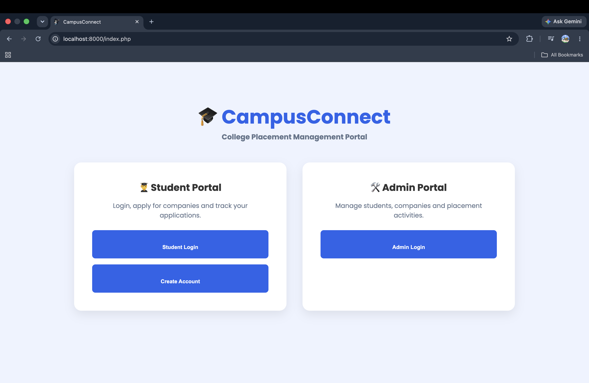
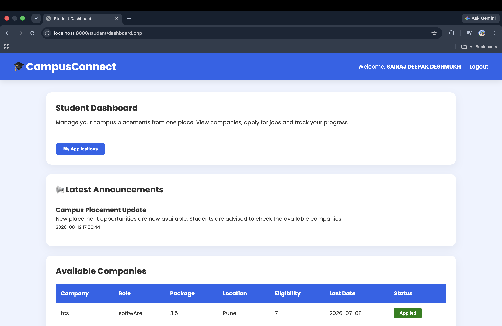
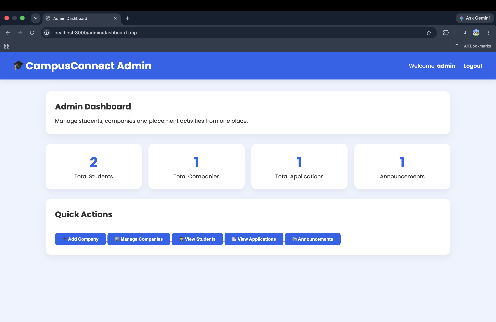
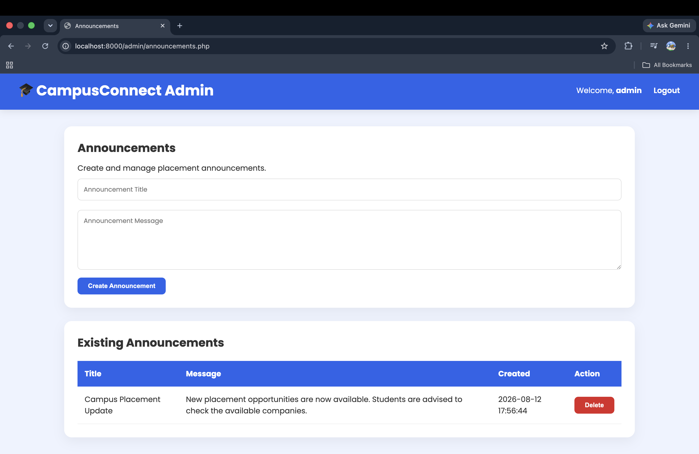

# CampusConnect 🎓

CampusConnect is a PHP and MySQL-based college placement management portal designed to simplify campus recruitment activities for students and administrators.

## Features

### 👨‍🎓 Student Module
- Student registration and login
- Student dashboard
- View available companies
- Apply for placement opportunities
- Prevent duplicate applications
- Track submitted applications
- View placement announcements

### 🛠️ Admin Module
- Secure admin login
- Admin dashboard with placement statistics
- View registered students
- View student applications
- Add companies
- Edit company details
- Delete companies
- Create placement announcements
- Delete announcements
- View announcement statistics

## Tech Stack

- **Backend:** PHP 8+
- **Database:** MySQL
- **Frontend:** HTML, CSS
- **Authentication:** PHP Sessions
- **Security:** Password hashing, prepared statements and input validation
- **Version Control:** Git & GitHub

## Database

The application uses a MySQL database named `campus_connect`.

Main tables:

- `students`
- `admins`
- `companies`
- `applications`
- `announcements`

The database schema is available in:

`database/database.sql`

## Project Structure

```text
CampusConnect/
├── admin/
├── assets/
│   └── css/
├── config/
├── database/
├── student/
├── index.php
├── login.php
├── logout.php
├── register.php
└── .gitignore
```

## Screenshots

### Landing Page



### Student Dashboard



### Admin Dashboard



### Announcements


